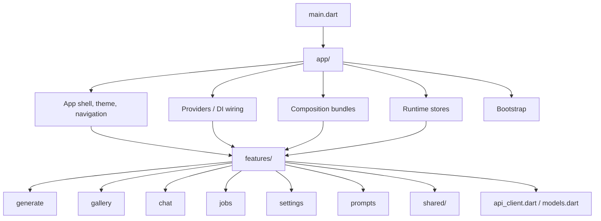
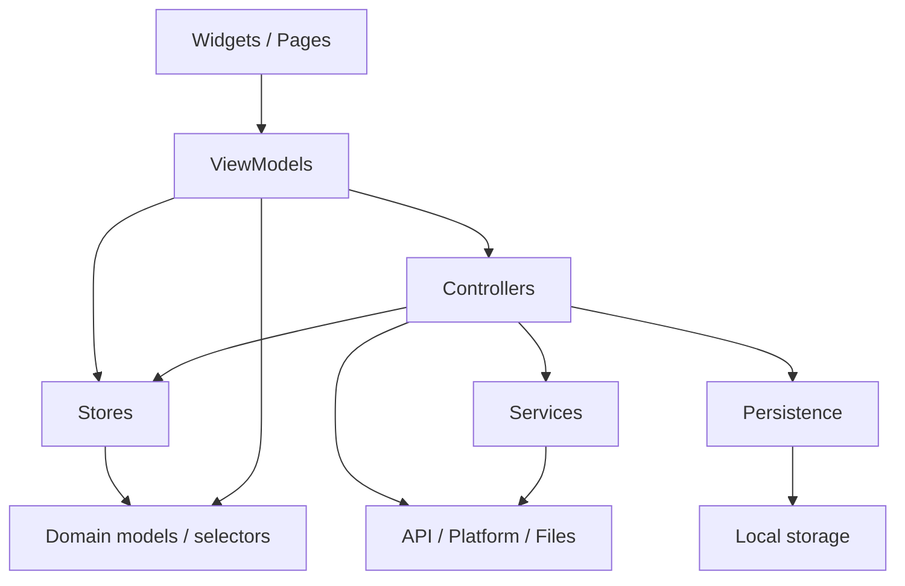
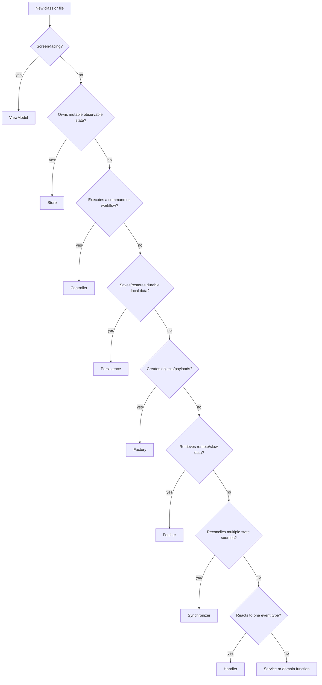
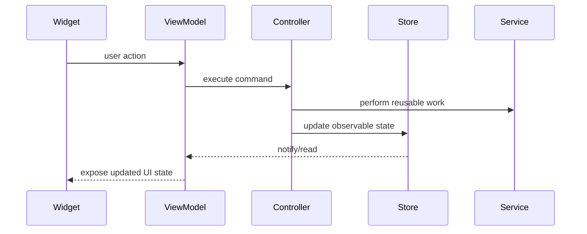
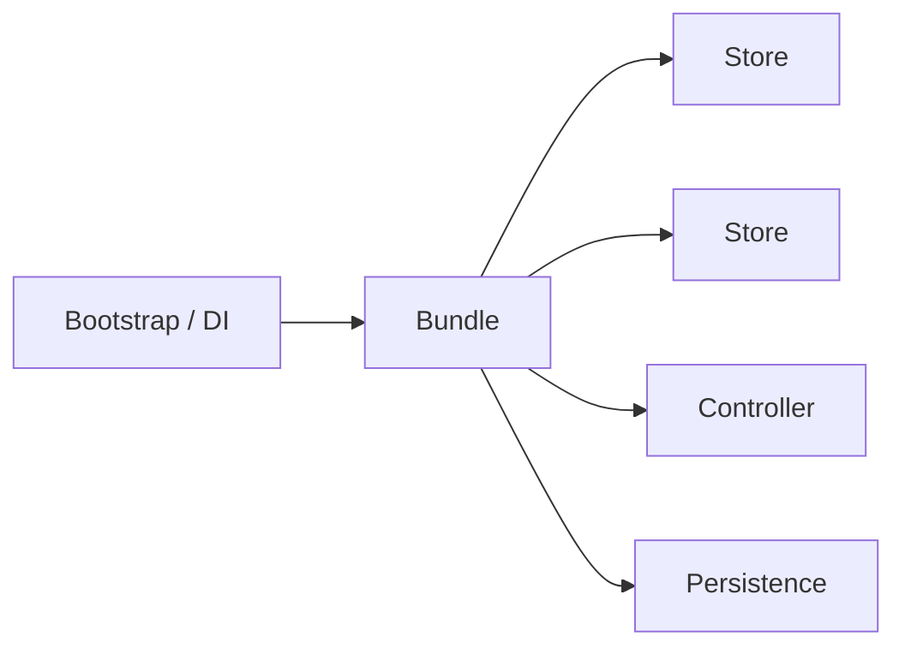
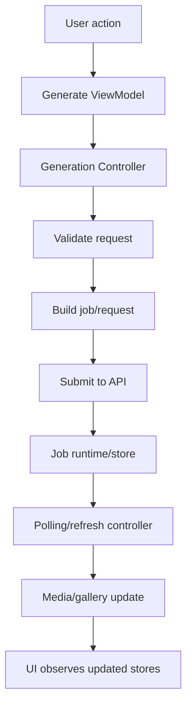

# App Architecture Guide

This document explains the frontend architecture at a level that should remain useful even as individual classes and screens change.

The goal of the structure is simple:

- keep UI code close to the feature it belongs to;
- keep app-wide wiring outside of features;
- name files by the responsibility they own;
- make state, workflows, and reusable logic easy to find;
- avoid catch-all folders and vague suffixes.

## Architecture at a glance

The Flutter app is organized around an application layer plus feature folders.



Use this mental model:

```txt
Widget → ViewModel → Controller → Store / Service / Persistence / API
```

For read-only display flows:

```txt
Widget → ViewModel → Store → Domain model
```

For background or app-wide flows:

```txt
Bootstrap / Timer / Listener → Controller → Store / Service / Persistence
```

## Top-level frontend folders

### `app/`

Contains application-level code that is not owned by one feature.

Typical contents:

- application shell and theme;
- navigation;
- bootstrap/startup;
- providers and dependency wiring;
- app-wide runtime stores;
- app-level persistence;
- composition bundles.

Use `app/` when the code answers:

> “How is the app assembled or coordinated?”

Do not put feature-specific UI or feature-specific business logic here.

### `features/`

Contains user-facing product areas. A feature folder owns its screens, view models, state, controllers, services, domain helpers, and persistence for that area.

Typical feature structure:

```txt
features/<feature>/
  <feature>_page.dart
  <feature>_view_model.dart
  controllers/
  state/
  services/
  domain/
  persistence/
```

Not every feature needs every subfolder. Add a subfolder only when it clarifies ownership.

### `shared/`

Contains reusable UI, formatting, and helper code that is genuinely shared by multiple features.

Use `shared/` carefully. If a helper is only used by one feature, keep it inside that feature.

### `di/`

Contains dependency registration and lookup infrastructure.

Dependency registration should wire objects together. It should not contain business workflows.

### Root files

Root-level files should be rare. Keep them for application entry points, cross-cutting models, API clients, or legacy files that have not yet been moved.

## Layering rules

The preferred dependency direction is top-down:



Avoid reverse dependencies:

- stores should not depend on widgets;
- services should not depend on view models;
- domain helpers should not depend on controllers;
- persistence should not depend on UI;
- feature code should not reach deeply into another feature unless the dependency is intentional.

When cross-feature behavior is required, prefer app-level composition or a clearly named controller/synchronizer over hidden imports between unrelated features.

## Core concepts and suffixes

The project intentionally uses a small vocabulary of suffixes. Prefer these names because they describe the role of a class.

### Default suffixes

| Suffix | Responsibility | Typical owner |
| --- | --- | --- |
| `ViewModel` | Adapts stores/controllers into screen-ready data and actions. | Feature UI |
| `Controller` | Executes commands and coordinates workflows. | Feature or app |
| `Store` | Owns mutable observable state over time. | Feature or app runtime |
| `Service` | Provides reusable capability or infrastructure logic. | Feature, app, shared |
| `Persistence` | Saves and restores durable local state. | App or feature |
| `Bundle` | Groups related dependencies for construction/composition. | App composition |

### Specialist suffixes

Specialist suffixes are allowed when they add clear meaning and avoid ambiguity.

| Suffix | Use when |
| --- | --- |
| `Factory` | The class mainly creates jobs, requests, models, or command payloads. |
| `Fetcher` | The class mainly retrieves data from a remote, slow, or external source. |
| `Detector` | The class mainly infers or detects one property from input data. |
| `Handler` | The class reacts to one specific event type. |
| `Synchronizer` | The class reconciles state between two or more systems. |
| `Selector` | The file exposes derived read-only logic from existing state. |
| `Codec` / `Mapper` | The class converts between serialized, API, domain, or UI shapes. |

### Avoid by default

Avoid these unless there is a strong reason:

| Suffix | Why |
| --- | --- |
| `Manager` | Usually too broad; hides responsibility. |
| `Helper` | Usually too vague; prefer `Service`, `Formatter`, `Parser`, or a plain function. |
| `Coordinator` | Often overlaps with `Controller` or `Synchronizer`; use the more specific one. |
| `Util` | Usually becomes a dumping ground. |

## Choosing the right suffix



When unsure between `Controller` and `Service`, use this rule:

```txt
Called as an app/user action?       → Controller
Used as a reusable capability?      → Service
```

When unsure between `Controller` and `Synchronizer`, use this rule:

```txt
Starts or owns a workflow?          → Controller
Reconciles already-existing state?  → Synchronizer
```

When unsure between `Store` and `State`, use this rule:

```txt
Mutable + notifies listeners?       → Store
Passive value snapshot?             → State/model
```

## Feature folder conventions

A feature may contain these subfolders:

### `state/`

Use for stores owned by the feature.

Stores may expose state and simple mutations. Keep heavy workflows in controllers.

Good fit:

```txt
gallery_browser_store.dart
generation_source_store.dart
chat_session_store.dart
```

### `controllers/`

Use for commands, user actions, and feature workflows.

Good fit:

```txt
image_generation_controller.dart
media_actions_controller.dart
job_polling_controller.dart
```

A controller may coordinate stores, services, persistence, API calls, and side effects.

### `services/`

Use for reusable feature logic that is not itself a UI command.

Good fit:

```txt
job_status_fetcher.dart
generation_job_factory.dart
image_orientation_detector.dart
```

### `domain/`

Use for domain-specific helpers, selectors, enums, value objects, and pure logic.

Good fit:

```txt
gallery_filtering.dart
job_status_selectors.dart
saved_prompt_collection.dart
```

Domain code should be easy to test and should avoid Flutter UI dependencies.

### `persistence/`

Use for feature-specific local storage.

Good fit:

```txt
inter_job_delay_persistence.dart
generation_source_persistence_codec.dart
```

If persistence is app-wide rather than feature-specific, put it under `app/persistence/`.

## ViewModel conventions

A ViewModel is the bridge between widgets and the rest of the app.

A ViewModel may:

- expose screen-ready values;
- combine multiple stores;
- expose button/menu actions;
- format lightweight UI labels;
- call controllers in response to user intent.

A ViewModel should avoid:

- direct API calls;
- direct file-system or storage access;
- large business workflows;
- becoming the only place where feature logic lives.

Preferred pattern:



## Store conventions

Stores hold mutable state. In Flutter, stores commonly extend or use `ChangeNotifier`.

A store should:

- own one coherent state area;
- expose read-only getters where practical;
- keep mutation methods small and named by intent;
- notify listeners after meaningful changes;
- avoid direct widget or navigation dependencies.

A store may perform simple persistence if it is tightly scoped. If persistence grows or is shared, extract a `Persistence` class.

Avoid stores that become “god objects”. If a store starts sending API requests, managing timers, writing files, and updating unrelated features, split the responsibilities.

## Controller conventions

Controllers are command/workflow entry points.

A controller may:

- validate an action;
- call APIs or services;
- coordinate multiple stores;
- trigger persistence;
- start or stop polling;
- handle error paths;
- emit side effects such as notifications.

A controller should:

- have method names that sound like commands;
- keep UI formatting out;
- avoid storing large amounts of long-lived state;
- be explicit about dependencies in its constructor.

Good controller methods:

```txt
generateImage()
sendMessage()
refreshGallery()
cancelJob()
deleteMedia()
saveConfiguration()
```

## Service conventions

Services provide reusable capabilities. They should have narrower names than controllers.

A service may:

- build a generation job payload;
- fetch job status;
- detect media orientation;
- transform data;
- encapsulate platform-specific behavior.

A service should not usually notify UI listeners. If it owns observable state, it is likely a `Store`.

## Synchronizer and Handler conventions

Use these only when they are more precise than `Controller`.

Use `Synchronizer` when the class reconciles state between systems:

```txt
job results ↔ gallery state ↔ media runtime state
```

Use `Handler` when the class reacts to a specific event:

```txt
job became terminal → update related stores and notifications
```

Do not use `Coordinator` as a softer version of either one. Prefer the more specific term.

## Composition and runtime

The app layer contains runtime stores and composition bundles.

### Runtime stores

Runtime stores hold app/session-level mutable state that is not owned by one screen.

Examples of runtime concepts:

- current connection status;
- currently active or selected job;
- media runtime cache/index state;
- draft state shared across screens;
- app activity flags.

Runtime stores belong under:

```txt
app/runtime/
```

### Bundles

Bundles group related dependencies for construction or dependency passing.

A bundle should be mostly structural. If it starts doing workflow work, that logic probably belongs in a controller.



## Persistence conventions

Persistence classes isolate durable local storage concerns.

Use persistence classes for:

- settings;
- user preferences;
- draft restoration;
- local feature configuration;
- storage codecs and migration helpers.

Persistence should not decide UI behavior. It should read/write values and return typed results.

Keep storage keys centralized when possible. Avoid scattering literal preference keys throughout the app.

## Import conventions

Prefer stable package imports when crossing folders:

```dart
import 'package:flutter_app/features/generate/state/generation_source_store.dart';
```

Relative imports are acceptable for nearby files inside the same folder or tightly coupled subfolder, but avoid deep relative imports across features.

Avoid importing from another feature’s internal `state/` or `controllers/` folder unless the dependency is intentional. If many features need the same concept, consider moving it to `app/`, `shared/`, or a domain/service boundary.

## File naming conventions

Use lower snake case for Dart files:

```txt
image_generation_controller.dart
gallery_browser_store.dart
job_status_fetcher.dart
settings_persistence.dart
```

The file name should match the primary class responsibility.

Prefer:

```txt
media_index_synchronizer.dart
class MediaIndexSynchronizer
```

Avoid:

```txt
media_helper.dart
class MediaManager
```

## UI conventions

Keep widgets focused on rendering and local interaction.

Widgets may:

- read a ViewModel;
- render values;
- call ViewModel methods for user actions;
- hold short-lived widget-only UI state.

Widgets should avoid:

- direct API calls;
- direct persistence access;
- cross-feature orchestration;
- complex job/media/generation workflows.

Large screens should be split into smaller widgets when the build method becomes hard to scan.

## Error, loading, and async conventions

Async operations should have clear ownership.

Prefer:

- controller owns operation flow;
- store owns loading/error values when they affect UI;
- ViewModel exposes display-ready state;
- widget renders loading/error states.

Avoid hiding errors in services. Return typed results, throw domain-appropriate exceptions, or update a clearly owned error store.

For long-running generation or media jobs, make polling/refresh behavior explicit and centralized rather than scattered across widgets.

## Generative app concerns

Because this app deals with image, video, and text generation, keep these concerns visible in the architecture:

- generation jobs may be long-running;
- job state can change outside the current screen;
- media files may be missing, deleted, replaced, or regenerated;
- prompt drafts and settings should be recoverable;
- API failures should not corrupt local state;
- user actions may need cancellation, retry, or refresh paths;
- expensive operations should not be triggered repeatedly by rebuilds;
- moderation, safety checks, and request validation should live before generation commands reach the backend.

Where possible, generation flows should be explicit:



## Adding new code

Before adding a new class, decide:

1. Which feature owns it?
2. Is it app-wide or feature-specific?
3. Is it UI, ViewModel, Controller, Store, Service, Persistence, or Domain?
4. Does an existing class already own this responsibility?
5. Will this create an unwanted dependency from one feature into another?

Preferred placement examples:

| New need | Placement |
| --- | --- |
| New generate screen UI | `features/generate/` |
| New gallery action | `features/gallery/controllers/` |
| New gallery filter rule | `features/gallery/domain/` |
| New app setting storage | `app/persistence/` or feature `persistence/` |
| New app-wide selected item state | `app/runtime/` |
| New job polling behavior | `features/jobs/controllers/` |
| New payload builder | feature `services/` as a `Factory` |
| New screen adapter | feature `*_view_model.dart` |

## Refactoring guidelines

When refactoring:

- move by responsibility, not by import convenience;
- rename files and classes together;
- update imports to package imports;
- avoid leaving stale duplicate files;
- keep compatibility shims temporary and documented;
- run `flutter analyze` after structural moves;
- prefer small, behavior-preserving commits.

If a class has multiple responsibilities, split in this order:

1. extract pure domain logic;
2. extract persistence;
3. extract services/factories/fetchers;
4. keep command orchestration in a controller;
5. keep mutable observable state in a store;
6. keep screen adaptation in a ViewModel.

## Architecture checklist

Use this checklist during reviews:

- Does the file live in the feature or app layer that owns it?
- Does the suffix match the actual responsibility?
- Are widgets free of API/persistence/workflow logic?
- Are stores focused on state instead of orchestration?
- Are controllers command-oriented?
- Are services reusable and narrower than controllers?
- Are persistence keys/codecs isolated?
- Are cross-feature dependencies intentional?
- Are long-running generation/job/media flows centralized?
- Would a new developer know where to add the next related change?

## Glossary

- **App layer**: app-wide shell, runtime, composition, providers, and bootstrap.
- **Feature**: a product area such as generate, gallery, chat, jobs, settings, or prompts.
- **Runtime store**: app/session-level mutable state shared across screens.
- **Domain logic**: pure or mostly pure business logic that does not depend on UI.
- **Composition**: code that constructs and wires related dependencies.
- **Command**: an action such as generate, refresh, delete, cancel, send, or save.
