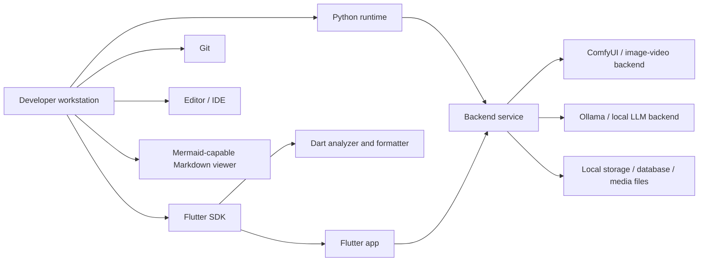
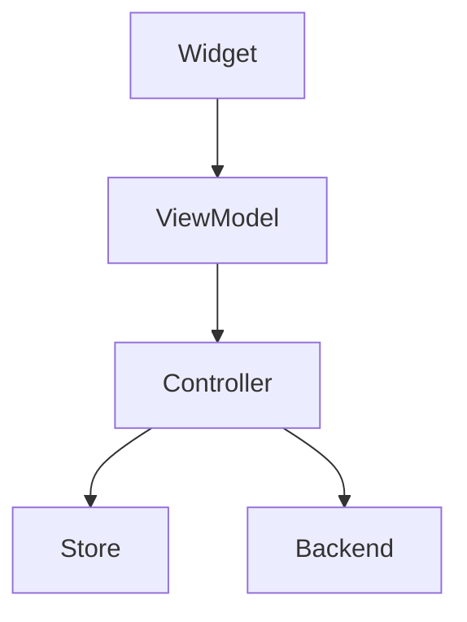
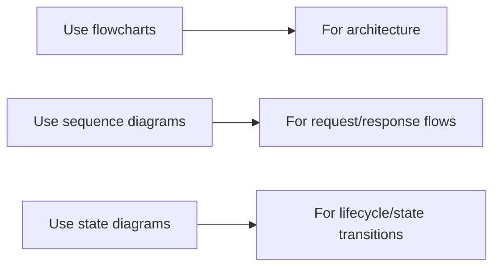
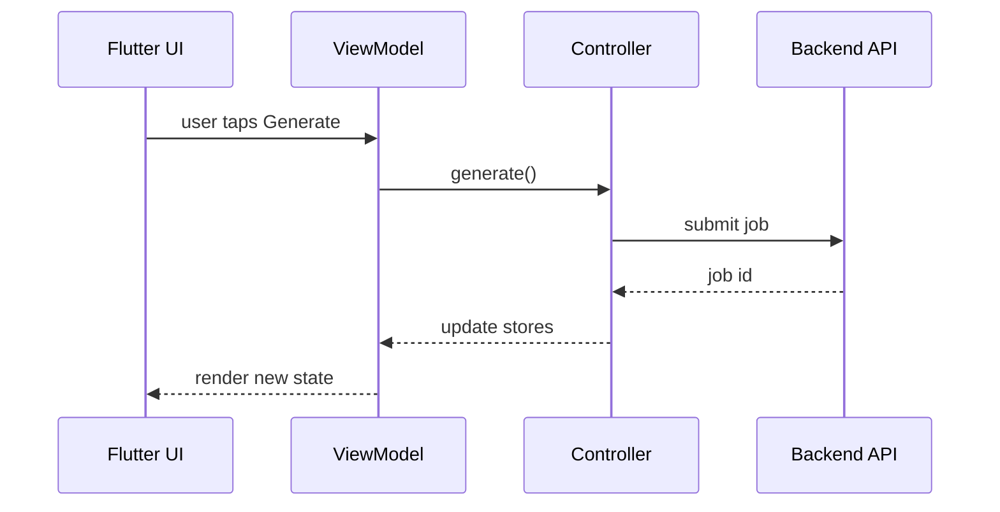
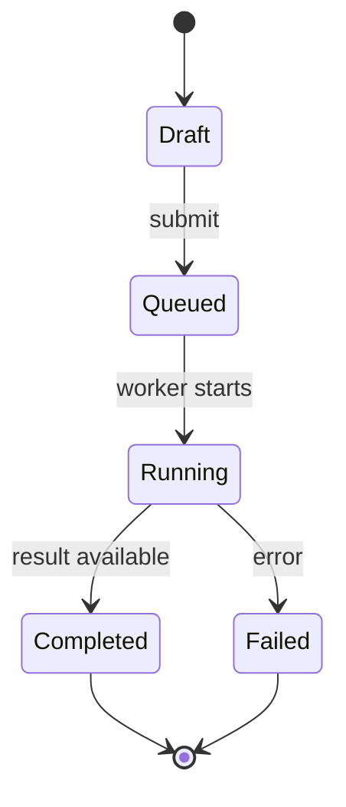
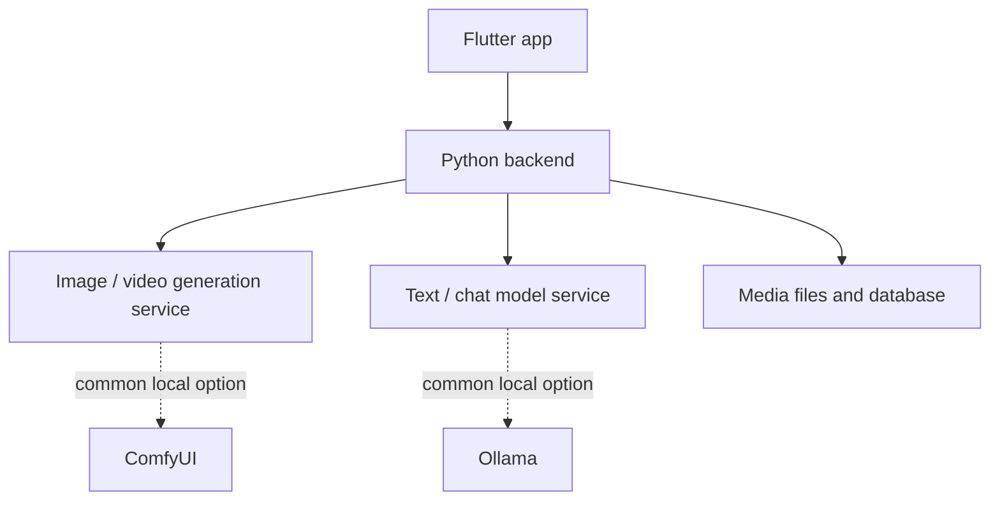
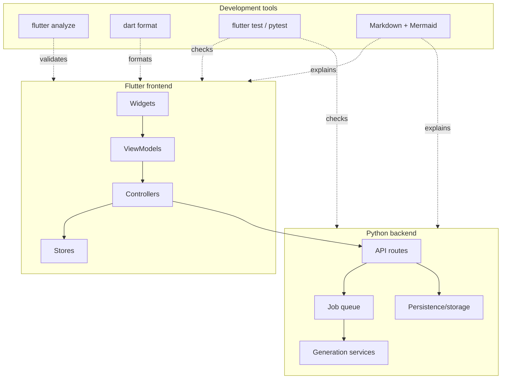
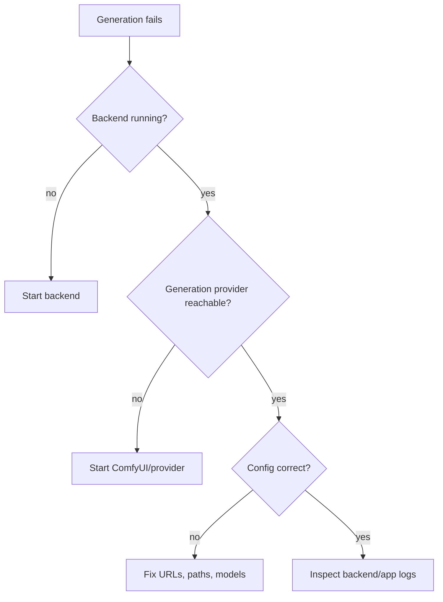

# Tools and Local Development Guide

This document describes the tools normally required to work on the app, how they fit together, and the common commands used during development.

It intentionally avoids strict version pins. Prefer the repository's checked-in toolchain, lockfiles, and project setup when they exist. If a version is not pinned by the project, use the current stable release for the tool unless the team documents otherwise.

## Tooling overview



## Required tools

### Flutter SDK

The frontend is a Flutter app. Flutter provides:

- `flutter run`
- `flutter analyze`
- `flutter test`
- `flutter pub get`
- Dart formatting and analysis through the bundled Dart SDK

Use the project-local Flutter binary when one is provided by the repository or development environment.

Example:

```bash
tools/flutter/bin/flutter --version
tools/flutter/bin/flutter analyze
```

If no project-local Flutter SDK exists, use the globally installed one:

```bash
flutter --version
flutter analyze
```

Run Flutter commands from the Flutter project directory, usually the directory that contains `pubspec.yaml`.

Example:

```bash
cd App
../tools/flutter/bin/flutter pub get
../tools/flutter/bin/flutter analyze
```

or, with a global Flutter install:

```bash
cd App
flutter pub get
flutter analyze
```

### Dart SDK

Dart is bundled with Flutter for this project. In most cases, use `flutter` commands instead of calling `dart` directly.

Common uses:

```bash
flutter analyze
dart format lib
```

Use `dart` directly for pure Dart tooling when needed:

```bash
dart format lib test
```

### Python

The backend is a Python service. Use a virtual environment instead of installing dependencies globally.

Example setup:

```bash
cd Backend
python3 -m venv .venv
source .venv/bin/activate
python -m pip install --upgrade pip
```

Install dependencies from the project's dependency file when present:

```bash
pip install -r requirements.txt
```

If the repository uses another dependency manager, such as Poetry, uv, or pip-tools, prefer the checked-in workflow for that project.

### Git

Use Git for source control and reviewable changes.

Common commands:

```bash
git status
git diff
git add .
git commit -m "Describe the change"
```

Before committing, run the relevant checks:

```bash
flutter analyze
flutter test
```

For backend-only changes, also run the backend checks used by the project.

### Editor / IDE

Recommended options:

- VS Code with Flutter, Dart, Python, and Mermaid Markdown extensions
- Android Studio / IntelliJ with Flutter and Dart plugins

The editor should be configured to:

- format Dart files on save, or before commit
- show Flutter analyzer diagnostics
- use the project's Python virtual environment for backend files
- render Mermaid diagrams in Markdown previews when possible

## Optional but useful tools

### Mermaid

Mermaid is used for lightweight architecture and flow diagrams inside Markdown files.

Use Mermaid when a diagram explains structure better than text, for example:

- app layering
- feature boundaries
- job lifecycle
- polling flows
- controller/store relationships
- backend integration flow

A Mermaid diagram is written inside a fenced Markdown block:

````markdown

````

Rendered example:


Common Mermaid diagram types:



Example sequence diagram:



Example state diagram:



#### Viewing Mermaid diagrams

Use any Markdown viewer that supports Mermaid. Good options include:

- GitHub / GitLab Markdown previews
- VS Code Markdown preview with a Mermaid extension
- JetBrains Markdown preview with Mermaid support
- Mermaid Live Editor for quick experiments

#### Validating Mermaid diagrams locally

For stricter validation or exported diagrams, install Mermaid CLI if the project allows Node-based tooling:

```bash
npm install --global @mermaid-js/mermaid-cli
```

Render a diagram file:

```bash
mmdc -i diagram.mmd -o diagram.svg
```

For Markdown files that contain Mermaid blocks, preview them in the editor or copy the diagram block into a `.mmd` file for validation.

Mermaid diagrams should stay high-level. Avoid encoding every class or method; those diagrams become outdated quickly.

### Node.js / npm

Node.js is not required for the Flutter or Python runtime by default, but it is useful when using Mermaid CLI or other documentation tools.

Check availability:

```bash
node --version
npm --version
```

Use Node only for tooling unless the project adds a JavaScript/TypeScript package.

### Platform SDKs

Depending on the target platform, Flutter may require additional SDKs.

Common examples:

- Android Studio / Android SDK for Android builds
- Xcode for iOS and macOS builds
- platform build tools for Linux, Windows, or desktop targets

Check Flutter's environment status:

```bash
flutter doctor
```

Fix the issues reported by `flutter doctor` before investigating app-specific build failures.

## External runtime services

The app is built around generated media and chat workflows. Some features depend on local or remote inference services.



### Backend API

The Flutter app talks to the backend through API calls. The backend should be running before testing generation, gallery refresh, job polling, chat, or system-status features.

Typical workflow:

```bash
cd Backend
source .venv/bin/activate
python -m <project_backend_entrypoint>
```

Use the actual backend entrypoint documented by the repository or startup scripts. If a helper script exists, prefer it over manually invoking modules.

### ComfyUI or image/video backend

Image and video generation workflows may require a running image/video backend such as ComfyUI or another configured provider.

General expectations:

- the backend service must be reachable from the Python API
- model paths and workflow files must match the local environment
- generated outputs must be stored where the app/backend expects them
- GPU/CUDA setup may be required for acceptable performance

Keep provider-specific paths and secrets out of source code. Prefer environment files, local config files, or ignored machine-specific settings.

### Ollama or text model backend

Chat and prompt-assistance features may use a local LLM backend such as Ollama or another configured provider.

General expectations:

- the text model service must be running
- required models must be pulled/available locally
- backend configuration must point to the correct base URL/model name
- timeouts should be expected for large local models

## Common development workflows

### Analyze the Flutter app

```bash
cd App
flutter analyze
```

With project-local Flutter:

```bash
cd App
../tools/flutter/bin/flutter analyze
```

Run this after renames, file moves, dependency changes, or large refactors.

### Format Dart code

```bash
cd App
dart format lib test
```

If the app source is not under `lib` in a local checkout, format the actual source directory used by the project.

### Run Flutter tests

```bash
cd App
flutter test
```

If there are no tests for a touched area, use analyzer output and manual smoke testing as the minimum safety net.

### Run the app

```bash
cd App
flutter run
```

For a specific device:

```bash
flutter devices
flutter run -d <device-id>
```

### Refresh Flutter dependencies

```bash
cd App
flutter pub get
```

Run this after editing `pubspec.yaml` or switching branches.

### Regenerate generated Dart files

Some projects use generated dependency-injection or serialization files. This project includes generated DI-style files, so when the source annotations or registrations change, use the project's configured generator.

Common command when `build_runner` is configured:

```bash
cd App
dart run build_runner build --delete-conflicting-outputs
```

Only use this when the project has the required generator dependencies in `pubspec.yaml`.

### Backend virtual environment

```bash
cd Backend
python3 -m venv .venv
source .venv/bin/activate
pip install -r requirements.txt
```

Deactivate when done:

```bash
deactivate
```

### Backend checks

Use the backend checks configured by the project. Common examples are:

```bash
python -m pytest
python -m compileall .
```

If the project does not yet define backend test commands, at minimum run import/compile checks before committing backend refactors.

## Where tools fit in the architecture



## Documentation conventions

Use Markdown for durable documentation.

Use Mermaid for:

- high-level flow
- relationships between layers
- request/job lifecycle
- state transitions

Avoid Mermaid for:

- exhaustive class maps
- every import relationship
- details that change whenever a file is renamed
- generated code

Recommended structure for docs:

```markdown
# Topic

Brief explanation.

## Concepts

What matters and why.

## Flow


## Commands

```bash
command here
```

## Conventions

Rules that should survive implementation details.
```

## Troubleshooting

### `flutter analyze` reports stale renamed classes

This usually happens after a refactor where old files still exist.

Check for stale files and imports:

```bash
grep -R "OldClassName" App/lib
grep -R "old_file_name" App/lib
```

If stale compatibility files were temporary, remove them once all imports are migrated.

### Flutter cannot find packages

Run:

```bash
cd App
flutter pub get
```

Then restart the analyzer or IDE.

### The app runs but generation does not work

Check the runtime services:



### Mermaid diagrams do not render

Use a Mermaid-capable Markdown viewer or install a Mermaid preview extension in the editor.

For local CLI rendering:

```bash
npm install --global @mermaid-js/mermaid-cli
mmdc -i diagram.mmd -o diagram.svg
```

### Backend imports fail

Activate the virtual environment and reinstall dependencies:

```bash
cd Backend
source .venv/bin/activate
pip install -r requirements.txt
```

Make sure the command is executed from the expected working directory.

## Tooling principles

- Prefer project-local tools over global tools when available.
- Keep exact tool versions in lockfiles or setup scripts, not prose documentation.
- Run analyzer after moving or renaming Dart files.
- Keep generated files generated; do not hand-edit them unless the project explicitly expects it.
- Keep local paths, model directories, API keys, and machine-specific settings out of source control.
- Add documentation when adding a new tool, script, service dependency, or required external process.
