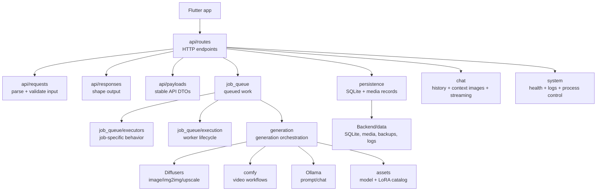
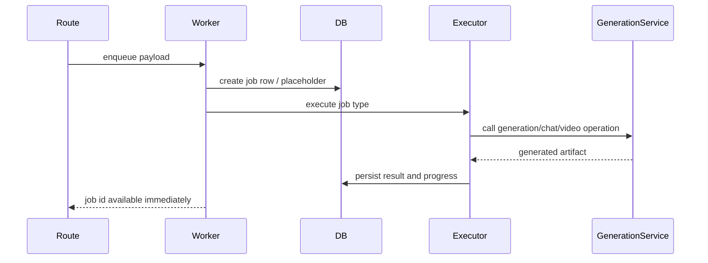

# Backend Architecture Guide

This guide describes the backend structure after the package reorganization. It is intentionally conceptual: it explains where code belongs, how major runtime flows work, and which boundaries should stay stable as individual endpoints or model workflows evolve.

The backend is a local-first Python/Flask service. It exposes HTTP APIs to the Flutter app, owns local SQLite persistence and media files, manages queued generation work, and coordinates local AI runtimes such as Diffusers, ComfyUI, and Ollama.

## Architecture at a glance



Core flow:

```txt
HTTP request
  -> API route
  -> request parser / validation
  -> persistence, queue, generation, chat, or system service
  -> response builder
```

Long-running generation flow:

```txt
HTTP request
  -> create queued job
  -> JobWorker
  -> executor / execution mixin
  -> generation service
  -> local runtime
  -> persistence + media storage
```

## Runtime assembly

The public backend entry point remains:

```python
from Backend import create_app
```

`Backend/__init__.py` is intentionally small and delegates to `Backend/app`.

### `Backend/app/app/`

Application bootstrap lives in the nested `app` package under `Backend/app/`.
`Backend/app/__init__.py` re-exports the public app-factory helpers from this
subpackage so imports such as `from Backend import create_app` and
`from app import create_app` continue to work.

| File | Responsibility |
| --- | --- |
| `factory.py` | Flask app factory, config loading, extension wiring, database setup, worker startup, blueprint registration. |
| `assets.py` | Initial asset catalog loading and legacy asset-ID remapping. |
| `commands.py` | Host shutdown / server restart command resolution. |
| `comfy_autostart.py` | Optional ComfyUI startup and recovered-job gating. |
| `logging.py` | Console logging, request logging, and log-store integration. |

Keep app assembly code in `app/app/`. Do not add feature logic or HTTP route
handlers here.

## Backend package map

```txt
Backend/
  app/           Flask app factory and startup wiring
  api/           HTTP boundary split into routes, requests, responses, payloads, common helpers
  assets/        model, LoRA, video model, and trigger discovery
  chat/          chat history, context images, Ollama streaming support
  comfy/         ComfyUI client, workflow graph editing, progress, output collection
  config/        default paths and runtime settings
  generation/    product-level generation orchestration and runtime adapters
  job_queue/     job models, worker, payload builders, executors, lifecycle helpers
  persistence/   SQLite database, mixins, schema, backups, media lifecycle
  storage/       filesystem helpers
  system/        logs, errors, machine info, shutdown/restart commands
```

## API layer

The API package is split by responsibility so unrelated HTTP concerns do not accumulate in a single flat folder.

```txt
Backend/api/
  routes/       Flask route modules grouped by domain
  requests/     request parsing, normalization, upload/import handling
  responses/    response shaping and streaming response helpers
  payloads/     serializable API payload builders / DTO-style helpers
  common/       small cross-cutting API validation utilities
```

### `api/routes/`

Routes should stay thin. They should:

- read path/query/body input;
- call request parser helpers when input is non-trivial;
- call persistence, queue, chat, system, or generation components;
- return response helper output.

Current route modules:

| Module | Endpoint area |
| --- | --- |
| `assets.py` | `/api/assets`, asset ratings/deletion, prompt/chat model listing, direct prompt generation. |
| `backups.py` | local database/media backups and app backup import/export. |
| `chat.py` | chat sessions, messages, context-image access, streaming chat responses. |
| `gallery.py` | image/media gallery, tags, thumbnails, posters, file serving. |
| `jobs.py` | queued image, video, prompt, chat, upscale, GIF, and audio-video jobs. |
| `system.py` | health, logs, errors, shutdown-when-idle, host shutdown, server restart, model unload. |
| `blueprint.py` | shared Flask blueprint object. |
| `context.py` / `helpers.py` | narrow route-context accessors and compatibility helpers. |

Avoid putting generation-runtime calls directly in a route unless the endpoint is intentionally synchronous and small.

### `api/requests/`

Use request modules for body parsing, upload handling, defaults, coercion, and source normalization.

Examples:

- `images.py`, `videos.py`, `chat.py`, `chat_jobs.py`;
- `prompts.py`;
- `sources.py`;
- `uploads.py`;
- `parsing.py`.

A request helper should produce plain Python values or small payload objects that downstream layers can consume without knowing Flask details.

### `api/responses/`

Use response modules for API output formatting and streaming helpers.

Examples:

- `jobs.py`, `gallery.py`, `media.py`;
- `chat_stream.py`, `chat_sessions.py`;
- `assets.py`, `backups.py`, `system.py`, `files.py`.

Routes should not hand-build large nested response payloads when a dedicated response helper exists.

### `api/payloads/`

Use payload modules for reusable API-facing DTO-style data shaping:

- `assets.py`;
- `chat.py`;
- `jobs.py`;
- `media.py`;
- `video_settings.py`.

Payload modules are the right place for stable JSON field selection and small transformations shared by multiple response helpers.

## Job queue layer

```txt
Backend/job_queue/
  worker.py           queue ownership, worker thread, public enqueue/cancel API
  models.py           queued job model
  builders/           job payload and placeholder builders
  execution/          generic worker lifecycle and job execution flow
  executors/          job-type-specific execution behavior
  maintenance/        temp cleanup and recurring maintenance
```

Typical queue flow:



Use `builders/` for constructing job payloads or placeholder records. Use `executors/` for work that depends on the job type. Use `execution/` for lifecycle concerns that should remain generic across job types.

## Generation layer

```txt
Backend/generation/
  interfaces.py          protocols / boundaries consumed by queue code
  service.py             DiffusersImageGenerator composition root
  local_pipelines.py     local Diffusers image pipeline handling
  video_generation.py    ComfyUI-backed video operations
  ollama_generation.py   prompt-generation operations
  ollama_runtime.py      low-level Ollama request/runtime management
  prompting.py           prompt composition and thinking-content parsing
  types.py               generation payload and artifact models
```

`DiffusersImageGenerator` coordinates the concrete runtime behavior, but queue and API code should depend on the `ImageGenerator` protocol where possible. That keeps tests and future runtime swaps simpler.

## ComfyUI integration

```txt
Backend/comfy/
  client.py              HTTP client for ComfyUI
  health.py              health checks
  generation.py          Comfy generation helpers
  media.py               media/result file handling
  outputs.py             output extraction
  progress.py            progress polling
  workflow_graph.py      graph lookup and patching primitives
  workflow_loras.py      LoRA injection helpers
  workflow_manager.py    public workflow manager facade
  workflow_runtime.py    runtime orchestration helpers
  workflow_video.py      video-workflow-specific operations
```

Treat ComfyUI as an external runtime. Keep ComfyUI node IDs, prompt payload details, polling behavior, and workflow patching inside `comfy/` or `generation/video_generation.py`, not in API route files.

## Persistence layer

```txt
Backend/persistence/
  database.py        AppDatabase composition class
  schema.py          SQLite schema setup/migrations
  records.py         record shaping helpers
  backups/           backup store implementation
  mixins/            focused persistence capability groups
```

`AppDatabase` composes focused mixins:

- `assets.py`;
- `chat.py`;
- `chat_attachments.py`;
- `gallery.py`;
- `jobs.py`;
- `media_lifecycle.py`;
- `media_records.py`.

Keep SQL and media lifecycle rules in persistence. Routes and job executors should not duplicate database update sequences.

## System layer

```txt
Backend/system/
  info.py            aggregate system-info facade
  cpu_info.py        CPU detection
  gpu_info.py        GPU detection
  memory_info.py     memory detection
  commands.py        command execution helpers
  parsing.py         command output parsing helpers
  log_store.py       managed log capture
  error_store.py     persisted error capture
  shutdown.py        shutdown/restart controller
```

System probing is intentionally split so OS command execution, parsing, and API response behavior do not live in one large module.

## Storage and data paths

Runtime data belongs under `Backend/data/` by default. Do not commit generated media, local SQLite files, logs, temp files, backups, or model caches.

Important paths are configured in `Backend/config.yaml`. These are local runtime locations; do not commit model weights, workflows, generated media, SQLite databases, logs, backups, or temp files:

```txt
Backend/assets/models/                    image models
Backend/assets/models/videos/             video models and ComfyUI workflow JSON
Backend/assets/loras/                     LoRAs
Backend/assets/loras_triggers/            optional LoRA trigger text files
Backend/data/app.db                       SQLite database
Backend/data/temp/                        temporary/generated media
Backend/data/stored/                      stored gallery media
Backend/data/backups/                     backups
Backend/data/logs/                        backend logs
Backend/data/errors/                      captured errors
```

## Dependency direction

Prefer this direction:

```txt
api -> chat / persistence / job_queue / system / generation interfaces
job_queue -> persistence / generation interfaces / system
generation -> assets / comfy / storage / runtime clients
persistence -> storage
app -> everything needed for assembly
```

Avoid reverse dependencies such as:

- `persistence` importing `api`;
- `generation` importing Flask route modules;
- `comfy` importing route modules;
- `api/responses` owning SQL or filesystem cleanup logic;
- `routes` constructing deep runtime payloads without request/payload helpers.

## Adding or moving backend code

Use these rules:

1. Put HTTP endpoints in `api/routes/`.
2. Put input parsing in `api/requests/`.
3. Put response formatting in `api/responses/`.
4. Put reusable API JSON payload construction in `api/payloads/`.
5. Put job payload/placeholder construction in `job_queue/builders/`.
6. Put job-specific execution in `job_queue/executors/`.
7. Put worker lifecycle behavior in `job_queue/execution/`.
8. Put generation/runtime orchestration outside the API layer.
9. Put SQL, backups, and media lifecycle behavior in `persistence/`.
10. Keep startup wiring in `app/`.

When splitting a file, preserve behavior first. Rename only when the new name makes ownership clearer.

## Error handling and observability

- Return user-visible API errors through response helpers.
- Persist backend exceptions in `system/error_store.py` where appropriate.
- Keep logs clear enough to diagnose model-path, ComfyUI, Ollama, and GPU-memory failures.
- Job progress should remain meaningful for long-running image/video operations.
- Cancellation paths should update both in-memory worker state and persisted job state.

## Validation

For backend-only refactors, at minimum run:

```bash
python -m compileall -q Backend
```

When dependencies are installed, also run:

```bash
python -m flask --app "Backend:create_app()" run --host 127.0.0.1 --port 5000
curl http://127.0.0.1:5000/api/health
curl http://127.0.0.1:5000/api/assets
```

If tests exist:

```bash
python -m unittest discover -s Backend/tests -q
```
