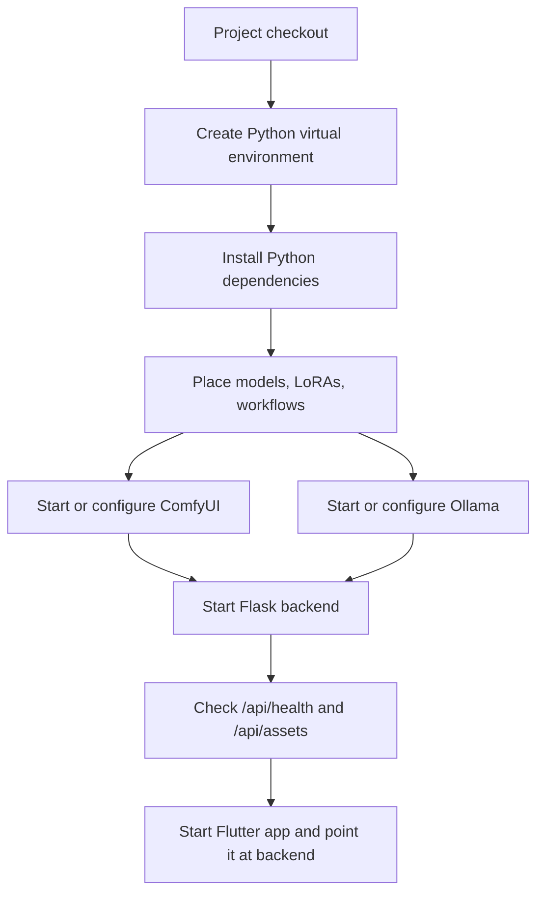
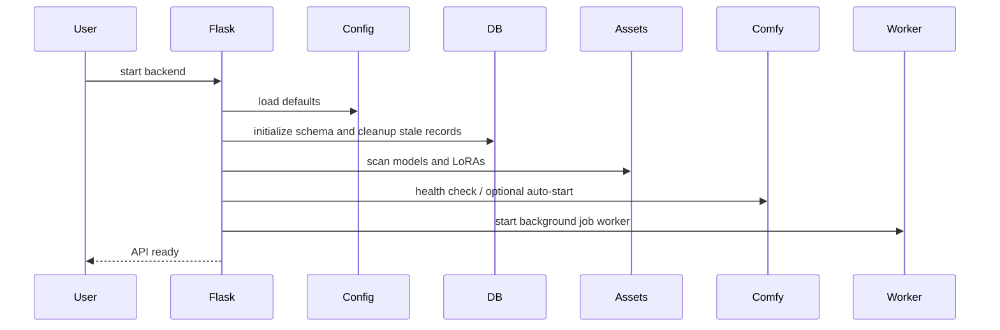

# Backend Setup Guide

This guide explains how to configure and start the backend, where to place models and ComfyUI workflow files, and what to check when getting NoviaGen running locally.

The backend is a local-first Flask service. It stores metadata in SQLite, stores media files on disk, queues generation jobs, and delegates AI work to local runtimes such as Diffusers, ComfyUI, and Ollama.

## Setup overview



## 1. Prepare Python

From the repository root:

```bash
python3 -m venv .venv
source .venv/bin/activate
python -m pip install --upgrade pip
```

On Windows PowerShell:

```powershell
py -3 -m venv .venv
.venv\Scripts\Activate.ps1
python -m pip install --upgrade pip
```

Install backend Python dependencies:

```bash
python -m pip install -r Backend/requirements.txt
```

Install or adjust ML dependencies for the machine that will run generation.

Typical categories:

```txt
torch
diffusers
sd_embed / sd-embed compatible package
xformers, if supported and desired
```

Install PyTorch using the command appropriate for the host GPU/OS. CPU-only installs may start the backend but will usually be too slow for generation.

## 2. Know the backend entry point

The public Flask app factory remains:

```txt
Backend:create_app()
```

Typical development command from the repository root:

```bash
python -m flask --app "Backend:create_app()" run --host 0.0.0.0 --port 5000
```

For local-only development:

```bash
python -m flask --app "Backend:create_app()" --debug run --host 127.0.0.1 --port 5000
```

Implementation detail: the factory is implemented in `Backend/app/factory.py`, while `Backend/__init__.py` re-exports `create_app` for compatibility.

## 3. Understand the default backend paths

Backend defaults are defined in:

```txt
Backend/config.yaml
```

The backend base directory is `Backend`. Important default paths:

```txt
Backend/assets/models/                    image models
Backend/assets/models/videos/             video models and ComfyUI workflow JSON
Backend/assets/loras/                     image LoRAs
Backend/assets/loras_triggers/            optional LoRA trigger-word text files
Backend/assets/unknown/                   fallback/holding area
Backend/data/app.db                       SQLite database
Backend/data/temp/                        temporary/generated media
Backend/data/stored/                      stored gallery media
Backend/data/backups/                     backups
Backend/data/logs/                        backend logs
Backend/data/errors/                      captured errors
```

These directories are created during startup if missing.

## 4. Place image models

Put image checkpoint files here:

```txt
Backend/assets/models/
```

The asset catalog scans model files in that directory and its subdirectories.
For local image generation, NoviaGen currently loads models with Diffusers
`StableDiffusionXLPipeline` and `StableDiffusionXLImg2ImgPipeline`, so the
supported image model architecture is SDXL.

Supported local image model families:

- Stable Diffusion XL base-compatible checkpoints;
- SDXL fine-tunes and derivatives that keep the SDXL architecture;
- Pony/Pony XL-style checkpoints, when they are SDXL-compatible checkpoints.

Not currently supported by the local Diffusers image path:

- Stable Diffusion 1.x or 2.x checkpoints;
- SD 3 / SD 3.5 checkpoints;
- FLUX checkpoints;
- Stable Cascade or other non-SDXL architectures;
- GGUF text/LLM files.

Those model families may still be usable through external ComfyUI workflows if
the workflow and ComfyUI installation support them. In that case, configure the
workflow under `generation.comfy.workflows.*`; do not place workflow-specific
assumptions in the local image model directory.

Prefer `.safetensors` SDXL checkpoints. The catalog can see other model-like
extensions, but generation compatibility is determined by the Diffusers SDXL
pipeline loader.

Example:

```txt
Backend/assets/models/
  example_image_model.safetensors
```

The model ID shown to the app is derived from the filename:

```txt
example_image_model.safetensors -> example_image_model
```

Keep model filenames stable if existing gallery/job metadata should continue referring to the same asset ID.

## 5. Place LoRAs

Put LoRA files here:

```txt
Backend/assets/loras/
```

Example:

```txt
Backend/assets/loras/
  cinematic_style.safetensors
```

Optional trigger words can be placed in matching text files:

```txt
Backend/assets/loras_triggers/
  cinematic_style.txt
```

The trigger file should share the LoRA base filename. The backend reads the text and exposes it with LoRA metadata.

## 6. Place video models and ComfyUI workflow files

The default video model/workflow directory is:

```txt
Backend/assets/models/videos/
```

The public default configuration leaves workflow paths blank. Configure the workflows you want to use with these keys:

```txt
generation.comfy.workflows.image_to_video
generation.comfy.workflows.image_to_video_loop
generation.comfy.workflows.image_prompt_generator
generation.comfy.workflows.video_upscaler
generation.comfy.workflows.video_to_audio
generation.comfy.workflows.text_to_video
```

Video model `.safetensors` files can also live in this folder. The asset catalog scans `.safetensors` files and filters out files that look like VAEs or text encoders.

Important: ComfyUI workflow JSON files often reference model filenames as they exist inside the ComfyUI installation. The backend can submit and patch workflows, but ComfyUI itself must also be able to resolve the referenced models and custom nodes.

## 7. Configure ComfyUI

Default backend ComfyUI URL:

```txt
http://127.0.0.1:8188
```

Check ComfyUI:

```bash
curl http://127.0.0.1:8188/system_stats
```

The public default config does not auto-start ComfyUI:

```txt
generation.comfy.autostart.enabled = false
```

Enable and configure auto-start only in an untracked local override file.

A typical manual ComfyUI startup looks like:

```bash
cd /path/to/ComfyUI
python main.py --listen
```

ComfyUI must have:

- required custom nodes installed;
- model files in the locations expected by its workflows;
- enough GPU memory for the selected workflow;
- a reachable HTTP API.

## 8. Configure Ollama

Default backend Ollama URL:

```txt
http://127.0.0.1:11434
```

Default prompt/chat model is configured by:

```txt
generation.ollama.prompt_model
```

Check Ollama:

```bash
curl http://127.0.0.1:11434/api/tags
```

The public default leaves `generation.ollama.prompt_model` blank. Install a compatible local model and configure its exact name before using prompt generation or chat features:

```bash
ollama pull <model-name>
```

Use the exact model name configured in your local backend config.

## 9. Start the backend

From the repository root, with the virtual environment active:

```bash
python -m flask --app "Backend:create_app()" run --host 0.0.0.0 --port 5000
```

Check health:

```bash
curl http://127.0.0.1:5000/api/health
```

Check visible assets:

```bash
curl http://127.0.0.1:5000/api/assets
```

If `/api/assets` returns no models, verify that `.safetensors` files are in the configured directories and restart the backend.

## 10. Connect the Flutter app

Start the Flutter app from `App/` and configure the backend base URL in the app settings.

Typical backend base URL:

```txt
http://127.0.0.1:5000
```

For Android emulator, the host machine may need:

```txt
http://10.0.2.2:5000
```

For a physical device, use the host machine's LAN IP and make sure the firewall allows connections to the backend port.

## Configuration reference

Important defaults live in `Backend/config.yaml`.

### Asset and model paths

```txt
paths.models_dir
paths.video_models_dir
paths.loras_dir
paths.lora_triggers_dir
paths.unknown_dir
assets.lora_default_strength
```

### Data and persistence paths

```txt
paths.data_dir
paths.logs_dir
paths.temp_dir
paths.stored_dir
paths.backups_dir
paths.errors_dir
paths.database_path
cleanup.temp_ttl_seconds
cleanup.interval_seconds
cleanup.deleted_media_retention_days
```

### ComfyUI settings

```txt
generation.comfy.url
generation.comfy.models_timeout_seconds
generation.comfy.workflows.image_to_video
generation.comfy.workflows.image_to_video_loop
generation.comfy.workflows.image_prompt_generator
generation.comfy.workflows.video_upscaler
generation.comfy.workflows.video_to_audio
generation.comfy.workflows.text_to_video
generation.comfy.autostart.enabled
generation.comfy.autostart.workdir
generation.comfy.autostart.executable
generation.comfy.autostart.args
generation.comfy.autostart.command
generation.comfy.autostart.health_path
generation.comfy.autostart.health_timeout_seconds
generation.comfy.autostart.wait_seconds
generation.comfy.autostart.poll_seconds
```

### Ollama settings

```txt
generation.ollama.url
generation.ollama.prompt_model
generation.ollama.prompt_timeout_seconds
chat.summary.keep_recent_messages
chat.summary.max_pending_chars
chat.mcp.local_env_path
chat.mcp.tool_timeout_seconds
chat.mcp.servers
chat.tool_loop.max_steps
chat.tool_loop.result_max_chars
```

Chat tools are loaded from `chat.mcp.servers` in `Backend/config.yaml`. Each server uses the common MCP stdio client shape:

```yaml
chat:
  mcp:
    servers:
      tool-server:
        command: /path/to/mcp-server
        args:
          - --transport
          - stdio
        env:
          API_TOKEN: ${LOCAL_TOOL_API_TOKEN}
```

Ollama remains the model runtime. NoviaGen discovers tools from configured MCP servers, passes enabled tool schemas to tool-capable Ollama models, executes requested MCP tool calls, and feeds tool results back to the model.

For machine-local secrets, place `KEY=value` entries in `Backend/noviagen.env`. This file is ignored by git and loaded at backend startup; process environment variables still take precedence. `Backend/obscure.env` is still supported as a legacy fallback.

### Job/system settings

```txt
jobs.inter_job_delay_seconds
system_commands.host_shutdown
system_commands.server_restart
system_commands.server_restart_delay_seconds
```

Host shutdown and server restart commands are blank by default. Configure them
only in a local override when the deployment environment should expose those
host-control actions.

## Local override pattern

For one-off local experiments, editing `Backend/config.yaml` is simple. For a cleaner local setup, copy it to an untracked file such as `Backend/config.local.yaml`, adjust that file, and point `NOVIAGEN_CONFIG_PATH` at it:

```bash
NOVIAGEN_CONFIG_PATH=Backend/config.local.yaml \
python -m flask --app "Backend:create_app()" run --host 127.0.0.1 --port 5000
```

Keep machine-specific paths, API keys, workflow files, generated media, and model weights out of committed source.

## Expected startup sequence



## Smoke test checklist

After starting everything:

```bash
curl http://127.0.0.1:5000/api/health
curl http://127.0.0.1:5000/api/assets
curl http://127.0.0.1:8188/system_stats
curl http://127.0.0.1:11434/api/tags
```

Then from the app:

1. Set the backend base URL.
2. Open the assets/model settings.
3. Confirm image models and LoRAs are visible.
4. Try a small image generation.
5. Try a prompt generation or chat message if Ollama is configured.
6. Try a ComfyUI-backed video workflow only after it works manually in ComfyUI.

## Backup and data notes

Generated/stored media and app metadata are local files.

Before destructive changes, copy:

```txt
Backend/data/
Backend/assets/
```

Backups created by the app are stored under:

```txt
Backend/data/backups/
```

Do not delete `Backend/data/app.db` unless you intentionally want to reset local metadata.

## Common setup problems

### Backend cannot import `Backend`

Run the Flask command from the repository root.

```bash
pwd
python - <<'PY'
import Backend
print(Backend)
PY
```

### No models appear

Check:

```txt
Backend/assets/models/*.safetensors
Backend/assets/loras/*.safetensors
Backend/assets/models/videos/*.safetensors
```

Then restart the backend.

### Image generation fails immediately

Check:

- image model file exists;
- selected model ID matches a scanned model;
- PyTorch/Diffusers dependencies are installed;
- GPU runtime is available;
- enough VRAM is free.

### Video generation fails

Check:

- ComfyUI is reachable;
- workflow JSON exists at the configured path;
- ComfyUI can run the workflow manually;
- all workflow model names resolve inside ComfyUI;
- required custom nodes are installed;
- backend and ComfyUI agree on paths/model names where needed.

### Prompt generation or chat fails

Check:

- Ollama is running;
- the configured model is installed;
- Ollama URL matches backend config;
- model memory requirements fit the host.

### Jobs stay queued

Check backend logs and ComfyUI health. Recovered ComfyUI jobs may wait for ComfyUI to become healthy before resuming.

### Port already in use

Use a different port:

```bash
python -m flask --app "Backend:create_app()" run --host 127.0.0.1 --port 5050
```

Then update the app backend base URL.

## Safe reset options

Clear temporary files only:

```bash
rm -rf Backend/data/temp/*
```

Clear logs only:

```bash
rm -rf Backend/data/logs/*
```

Full local reset:

```bash
rm -rf Backend/data
```

A full reset deletes jobs, metadata, logs, backups, and generated/stored media under the default data directory. Keep a copy first if anything matters.

## Minimum running definition

NoviaGen is ready for normal local use when:

```txt
Backend /api/health responds
/api/assets shows the expected models
ComfyUI health responds if video features are needed
Ollama tags respond if prompt/chat features are needed
Flutter app can reach the backend base URL
A simple queued generation job completes
```
