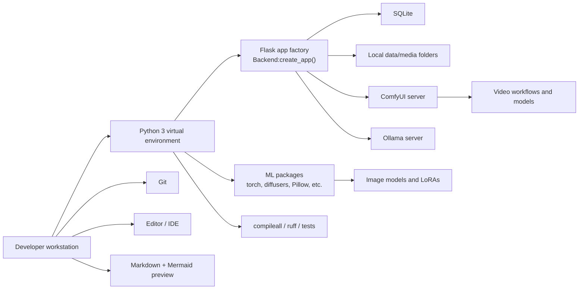
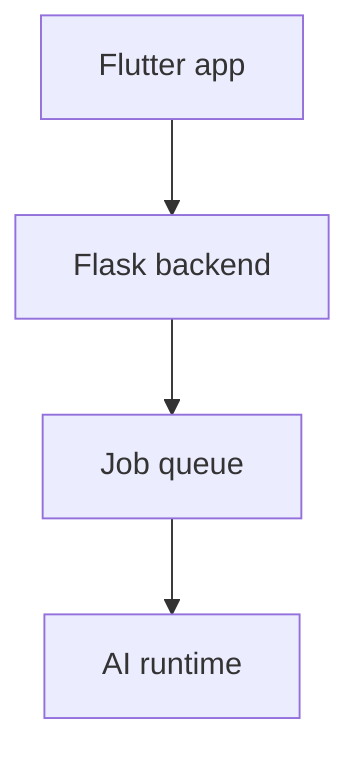

# Backend Tools and Local Development Guide

This document describes the tools normally required to develop, run, refactor, and troubleshoot the backend.

It avoids strict version pins unless the repository itself pins them. Prefer checked-in lockfiles or deployment scripts when they exist. If no version is pinned, use a current stable release compatible with the installed AI runtimes.

## Tooling overview



## Required tools

### Python

The backend is a Python application. Use a virtual environment so backend dependencies do not conflict with system Python packages.

Typical setup:

```bash
python3 --version
python3 -m venv .venv
source .venv/bin/activate
python -m pip install --upgrade pip
```

On Windows PowerShell:

```powershell
py -3 -m venv .venv
.venv\Scripts\Activate.ps1
python -m pip install --upgrade pip
```

### Flask

The backend is exposed through a Flask app factory.

Typical development command from the repository root:

```bash
python -m flask --app "Backend:create_app()" run --host 127.0.0.1 --port 5000
```

Use `0.0.0.0` only when you intentionally want LAN access:

```bash
python -m flask --app "Backend:create_app()" run --host 0.0.0.0 --port 5000
```

### SQLite

SQLite is used for local persistence. No separate database server is required.

The configured database path defaults to:

```txt
Backend/data/app.db
```

The database schema is initialized by backend startup code.

### Git

Use Git for source control and for keeping local configuration/model changes separate from code changes.

Recommended habits:

```bash
git status
git diff
git add Backend/doc/ARCHITECTURE.md Backend/doc/TOOLS.md Backend/doc/SETUP.md AGENTS.md
git commit -m "Update backend documentation"
```

### Editor / IDE

Use an editor with Python language support.

Recommended capabilities:

- Python syntax checking;
- import navigation and rename support;
- format-on-save;
- Markdown preview;
- Mermaid preview or Mermaid-compatible Markdown rendering.

### Mermaid

Mermaid is used in Markdown documentation for architecture and setup diagrams.

Many tools render Mermaid automatically:

- GitHub/GitLab Markdown;
- some IDE Markdown previews;
- documentation sites;
- Mermaid Live Editor;
- Mermaid CLI.

Basic Mermaid example:



For local validation with Node/npm installed:

```bash
npm install --global @mermaid-js/mermaid-cli
mmdc --version
```

Render a diagram file:

```bash
mmdc -i diagram.mmd -o diagram.svg
```

For Markdown files, a Mermaid-capable viewer is usually enough.

## Python dependencies

The code imports these main third-party packages:

```txt
flask
requests
Pillow
PyYAML
imageio
imageio-ffmpeg
torch
diffusers
sd-embed
xformers
```

Depending on the environment, package names may differ from import names:

```txt
PIL       -> Pillow
yaml      -> PyYAML
sd_embed  -> sd-embed or the package documented by the runtime setup
```

A typical backend install from the repository root is:

```bash
python -m pip install -r Backend/requirements.txt
```

Install ML/GPU packages according to the host OS, GPU, CUDA/ROCm/Metal support, and the instructions for PyTorch, Diffusers, ComfyUI, and the embedding package used by the project.

Do not blindly install GPU packages from random commands. Match the installation to the machine that will run the models.

## Optional but useful Python tools

### Syntax/import sanity check

For refactors that move files or update imports:

```bash
python -m compileall -q Backend
```

This is the fastest minimum check and should be run before returning a backend refactor.

### Formatter and linter

Use Ruff to keep Python diffs small and catch simple mistakes:

```bash
python -m pip install ruff
ruff format Backend
ruff check Backend
```

Useful after folder moves:

```bash
ruff check Backend --select F401,F821,F841
```

### Type checker

A type checker can help on refactors:

```bash
python -m pip install mypy
mypy Backend
```

The project may not be fully typed for strict checking. Treat type checking as a useful signal, not necessarily a release gate unless the team decides so.

### Test runner

If tests are added, either `unittest` or `pytest` can be used.

Existing documented command:

```bash
python -m unittest discover -s Backend/tests -q
```

If the project adopts pytest:

```bash
python -m pip install pytest
pytest
```

## External runtime tools

### ComfyUI

ComfyUI is used for video-related workflows and some prompt/video operations.

The backend talks to ComfyUI over HTTP, normally at:

```txt
http://127.0.0.1:8188
```

The backend can also try to auto-start ComfyUI if enabled by configuration.

Useful check:

```bash
curl http://127.0.0.1:8188/system_stats
```

Common failure modes:

- ComfyUI is not running;
- ComfyUI runs on a different port;
- required custom nodes are missing;
- workflow JSON references model files that are not installed;
- model names in workflow JSON do not match files in ComfyUI;
- GPU memory is already occupied by another runtime.

### Ollama

Ollama is used for prompt and chat generation.

The backend talks to Ollama over HTTP, normally at:

```txt
http://127.0.0.1:11434
```

Useful check:

```bash
curl http://127.0.0.1:11434/api/tags
```

Pull or install the configured prompt/chat model before using features that depend on it.

### Chat MCP Tools

Chat tools are discovered from the `chat.mcp.servers` section in `Backend/config.yaml`. Tool-capable Ollama models receive the enabled tool schemas, NoviaGen executes requested MCP tool calls, and the tool results are appended back into the chat loop before the final answer.

Each server entry keeps the common MCP stdio client shape:

```yaml
chat:
  mcp:
    servers:
      tool-server:
        command: /path/to/mcp-server
        args:
          - --transport
          - stdio
        env:
          API_TOKEN: ${LOCAL_TOOL_API_TOKEN}
```

Use `Backend/noviagen.env` for local secrets, then reference them from the MCP server config with `${LOCAL_TOOL_API_TOKEN}`. `Backend/obscure.env` is still accepted as a legacy fallback. Any MCP-compatible stdio server can be configured this way.

### GPU tooling

Depending on the host, useful tools include:

```bash
nvidia-smi
rocminfo
nvcc --version
```

Use them to confirm that the machine sees the GPU and that another process is not consuming all memory.

## Common backend commands

Run the backend:

```bash
python -m flask --app "Backend:create_app()" run --host 127.0.0.1 --port 5000
```

Run with Flask debug mode:

```bash
python -m flask --app "Backend:create_app()" --debug run --host 127.0.0.1 --port 5000
```

Check Python imports:

```bash
python - <<'PY'
from Backend import create_app
app = create_app()
print(app.name)
PY
```

Check backend health after startup:

```bash
curl http://127.0.0.1:5000/api/health
```

Inspect assets visible to the backend:

```bash
curl http://127.0.0.1:5000/api/assets
```

Run the minimum backend refactor check:

```bash
python -m compileall -q Backend
```

Format Python code with Ruff:

```bash
ruff format Backend
```

Lint Python code with Ruff:

```bash
ruff check Backend
```

Clean stale Python bytecode:

```bash
find Backend -type d -name "__pycache__" -prune -exec rm -rf {} +
```

## Backend folder checks during refactors

After moving files, confirm the intended package boundaries:

```bash
find Backend/api -maxdepth 2 -type f | sort
find Backend/job_queue -maxdepth 2 -type f | sort
find Backend/persistence -maxdepth 2 -type f | sort
```

Expected API grouping:

```txt
Backend/api/routes/
Backend/api/requests/
Backend/api/responses/
Backend/api/payloads/
Backend/api/common/
```

Expected job queue grouping:

```txt
Backend/job_queue/builders/
Backend/job_queue/execution/
Backend/job_queue/executors/
Backend/job_queue/maintenance/
```

Expected persistence grouping:

```txt
Backend/persistence/backups/
Backend/persistence/mixins/
```

## Troubleshooting

### `ModuleNotFoundError`

The virtual environment is probably missing a dependency or the command is running from the wrong directory.

Check:

```bash
pwd
which python
python -m pip list
```

Start from the repository root so the `Backend` package is importable.

### Backend starts, but the app cannot connect

Check:

- backend host and port;
- firewall;
- whether the Flutter app's backend base URL matches the Flask server;
- whether `127.0.0.1` is being used from an emulator/device where that address points to the device instead of the host machine.

### ComfyUI-dependent jobs fail

Check:

```bash
curl http://127.0.0.1:8188/system_stats
```

Then verify:

- workflow JSON files exist;
- workflow JSON references installed model names;
- ComfyUI custom nodes are installed;
- ComfyUI can run the workflow manually;
- the GPU has enough free memory.

### Ollama-dependent jobs fail

Check:

```bash
curl http://127.0.0.1:11434/api/tags
```

Then verify:

- the configured model exists;
- Ollama is listening on the configured URL;
- context window and model memory requirements fit the machine.

### Models do not show in the app

Check that files are placed in the configured directories and have supported extensions.

Then restart the backend or use the relevant refresh/reload path if the app exposes one.

### Route moved but endpoint missing

Route modules are registered by importing them from `Backend/api/routes/__init__.py`. If a new route module is added, make sure it is imported there for side-effect registration.

### Stale code after refactors

Python does not usually require a build step, but stale `__pycache__` files can make debugging confusing when files were moved manually.

Safe cleanup:

```bash
find Backend -type d -name "__pycache__" -prune -exec rm -rf {} +
```

### Mermaid diagrams do not render

Use a Mermaid-capable Markdown viewer. If the viewer does not support Mermaid, the fenced code blocks will show as text.

For local rendering, use Mermaid CLI:

```bash
npm install --global @mermaid-js/mermaid-cli
mmdc -i diagram.mmd -o diagram.svg
```
