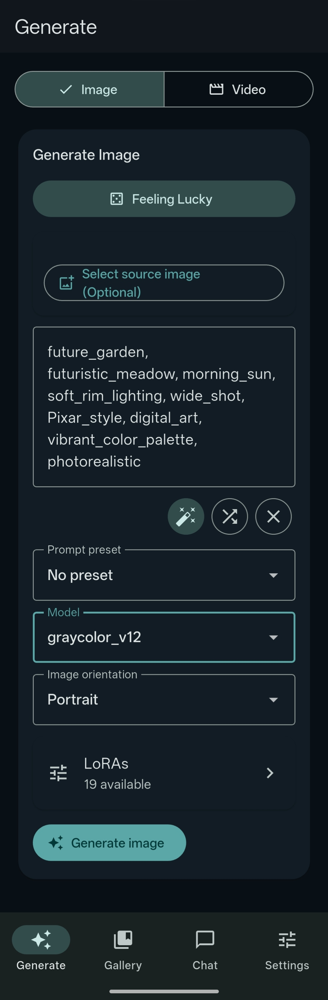
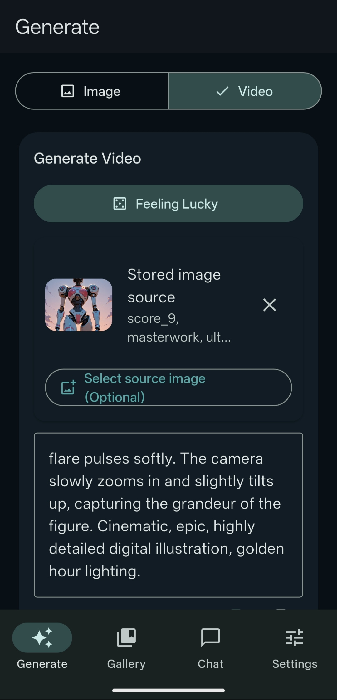
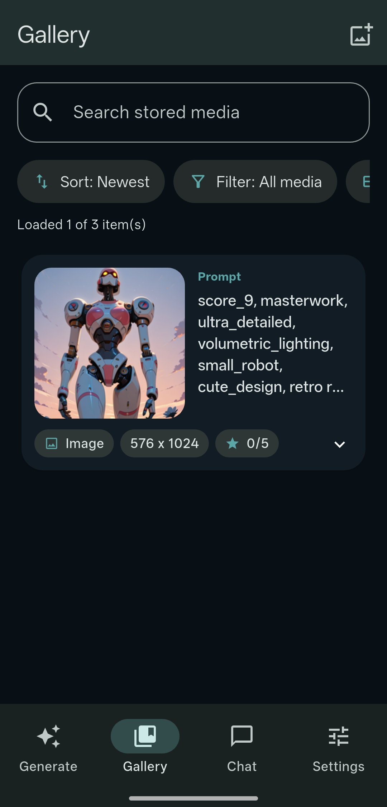
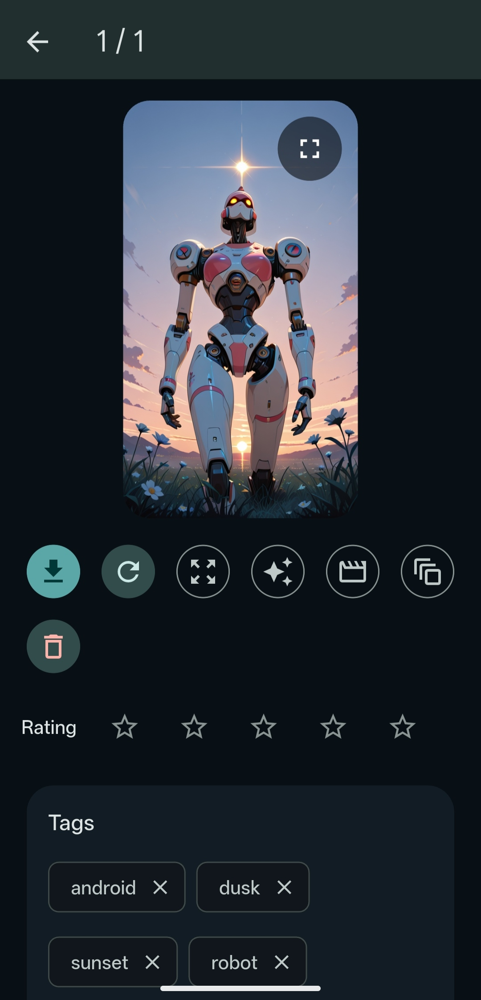
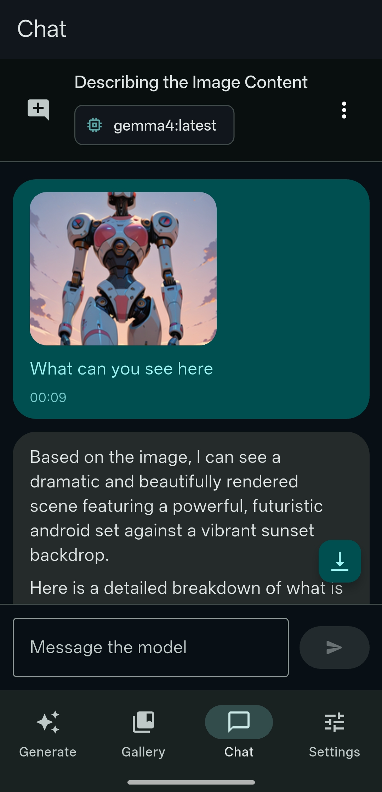
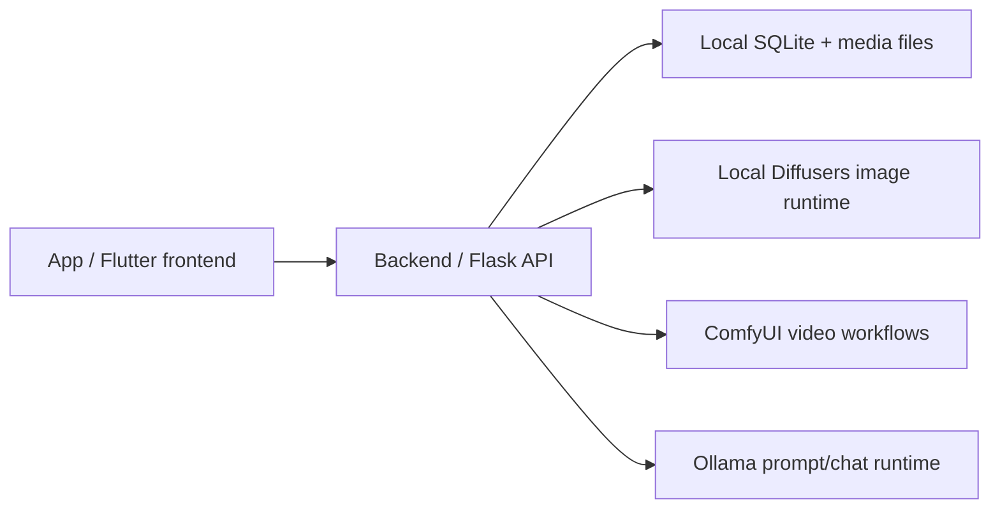
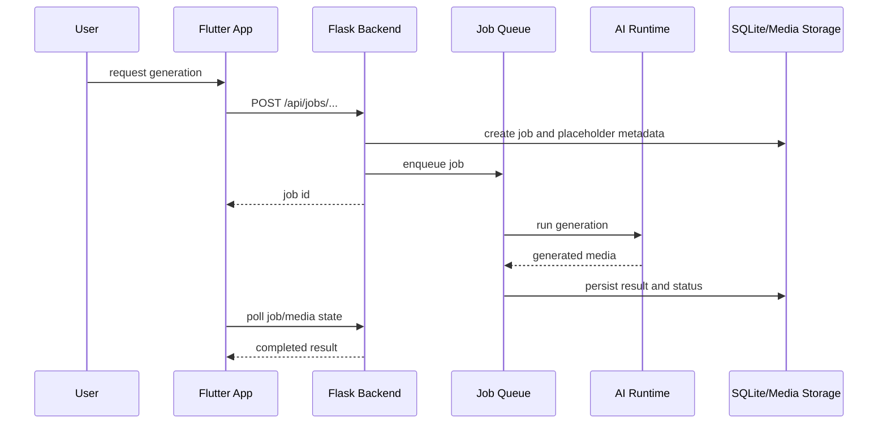

# NoviaGen

NoviaGen is a local-first generative media application with a Flutter frontend and a Python backend. It supports image, video, prompt, and chat workflows by coordinating local model files, queued jobs, persistent media storage, and external AI runtimes such as ComfyUI and Ollama.

## ⭐ Features ⭐

- 🖼️ `text2image` and `image2image` generation
- 🎬 `text2video` and `image2video` generation
- 🎞️ GIF generation for lightweight animated outputs
- 📏 Scaling and upscaling tools for generated media
- 🔊 Add audio to videos directly in your workflow
- ✍️ Prompt generation and prompt workflows
- 💬 Chat
- 🍀 `Feeling Lucky` mode for fast one-tap generation
- 🧠 Memory-friendly runtime behavior with only one model loaded at a time
- 🧩 Bring your own models and ComfyUI workflows
- 🖼️ Gallery tools including auto-tagging, ratings, slideshow mode, and image import from device
- ⚙️ Settings and power-user controls for presets, base prompts, prompt-generation guidelines, backups, job queue management, server restart, host shutdown, shutdown after jobs finish, wake-up host behavior, and more

## 📸 Screenshots

<details>
<summary>🖼️ Text to Image</summary>

<br />

<p align="center">
  
</p>
</details>

<details>
<summary>🎬 Image to Video</summary>

<br />

<p align="center">
  
</p>
</details>

<details>
<summary>🖼️ Gallery</summary>

<br />

<p align="center">
  
</p>
</details>

<details>
<summary>🔎 Gallery Details</summary>

<br />

<p align="center">
  
</p>
</details>

<details>
<summary>💬 Chat</summary>

<br />

<p align="center">
  
</p>

</details>

# Test Environment

This project was tested on Linux with a Nvidia GPU.

# Structure

The project is split into two main parts:



## Documentation

Start here:

- [Frontend architecture](App/doc/ARCHITECTURE.md)
- [Frontend tools and development](App/doc/TOOLS.md)
- [Backend architecture](Backend/doc/ARCHITECTURE.md)
- [Backend tools and development](Backend/doc/TOOLS.md)
- [Backend setup guide](Backend/doc/SETUP.md)
- [Contributing](CONTRIBUTING.md)
- [Security policy](SECURITY.md)
- [Third-party dependency and runtime asset notes](THIRD_PARTY_NOTICES.md)

## Project layout

```txt
App/
  lib/
    app/           app shell, bootstrap, runtime stores, providers
    features/      feature-specific UI, view models, stores, controllers
    shared/        reusable frontend widgets/helpers
    di/            dependency injection and registrations
  doc/             frontend architecture and tool guides

Backend/
  __init__.py      compatibility entry point for Backend:create_app()
  app/             Flask app factory, runtime packages, API, queue, persistence
  config.yaml      backend defaults and runtime settings
  doc/             backend architecture, setup, and tool guides
  tests/           backend tests
```

## Runtime overview



## Getting started

For a local setup, read the backend setup guide first:

[Backend setup guide](Backend/doc/SETUP.md)

At a high level:

1. Create a Python virtual environment.
2. Install backend dependencies.
3. Place image models, LoRAs, video models, and ComfyUI workflow files in the configured backend asset directories.
4. Start or configure ComfyUI.
5. Start or configure Ollama if prompt/chat features are needed.
6. Start the Flask backend.
7. Start the Flutter app and point it to the backend base URL.

Typical backend command:

```bash
python -m flask --app "Backend:create_app()" run --host 127.0.0.1 --port 5000
```

For LAN access, bind explicitly to all interfaces and make sure you trust the
network you are exposing the backend on:

```bash
python -m flask --app "Backend:create_app()" run --host 0.0.0.0 --port 5000
```

Health check:

```bash
curl http://127.0.0.1:5000/api/health
```

Asset check:

```bash
curl http://127.0.0.1:5000/api/assets
```

## Development principles

- Keep UI behavior in the frontend.
- Keep long-running generation behind backend jobs.
- Keep runtime-specific integration details inside their runtime folder.
- Keep durable state changes in persistence code.
- Use names that describe responsibility rather than vague utility buckets.
- Prefer small boundaries that are easy to test without requiring GPU runtimes.

## Data and models

By default, backend data and assets live under:

```txt
Backend/assets/
Backend/data/
```

The backend setup guide explains the expected directory layout and which files belong where.

Do not delete `Backend/data/` unless you intentionally want to reset local metadata and generated media.

## Content, models, and workflows

This repository does not include AI model weights, LoRAs, generated media, ComfyUI workflow files, or local databases. Users must provide their own runtime assets and are responsible for complying with the licenses and content policies for those assets and for any generated output.

Local Diffusers image generation currently supports SDXL-compatible checkpoint
files, including SDXL fine-tunes and Pony/Pony XL-style SDXL derivatives. Other
model architectures, such as Stable Diffusion 1.x/2.x, SD 3/3.5, FLUX, and
Stable Cascade, are not supported by the local image pipeline unless support is
added in code. They may still be usable through user-provided ComfyUI workflows
when ComfyUI and the workflow support them.
